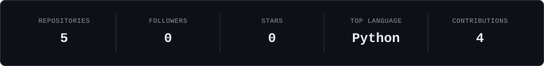
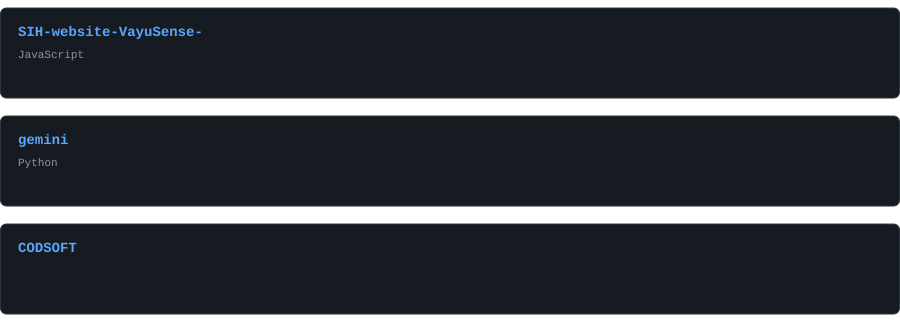

<!--
  This README is auto-generated by scripts/generate_readme.py.
  Edit data/profile.yaml (and re-run the generator) to update.
-->

  

  
    <code>Electronics & Communication Engineering</code>
  

 

## about

Electronics and Communication Engineering student building systems across embedded electronics, IoT, AI and full-stack development. I work on projects that connect physical hardware to intelligent software — from sensors and PCB systems to edge AI, backend APIs and real-time dashboards. Currently exploring biosensors, healthcare devices, intelligent embedded systems and practical AI applications.

**education**

**Bachelor of Engineering** &nbsp;·&nbsp; in *Electronics and Communication Engineering* &nbsp;·&nbsp; at _(Chennai Institute of Technology)_ &nbsp;·&nbsp; `2024-2028` &nbsp;·&nbsp; **CGPA 8.02**

 

## stack

> **languages**
> `C` · `C++` · `Python` · `Java` · `JavaScript`

> **frontend**
> `React.js` · `HTML` · `CSS` · `JavaScript` · `Figma` · `Adobe XD`

> **backend**
> `Node.js` · `Express.js` · `Flask` · `Django` · `REST API` · `Microservices`

> **databases**
> `MongoDB` · `MySQL` · `PostgreSQL`

> **ai / ml**
> `TensorFlow` · `TensorFlow Lite` · `scikit-learn` · `Edge AI` · `Generative AI` · `LLM Integration` · `Predictive Analytics`

> **other**
> `Internet of Things` · `Blockchain` · `PCB Design` · `MQTT` · `UI/UX` · `Prototyping` · `Embedded C`

 

## projects

### **GPS Tracker for Logistics**
`IoT` · `GPS Module` · `Python` · `Flask` · `REST API` · `React.js` · `MongoDB` · `Full Stack`

Built a real-time logistics tracking system using GPS integration, a Flask REST API for live location updates, and a React dashboard for route visualization and delivery monitoring.

### **Mobile-Assisted Context-Aware Motorcycle Safety System**
`IoT` · `Embedded C` · `Node.js` · `REST API` · `React.js` · `Android` · `Java`

Developed an IoT-based motorcycle safety system with real-time sensor communication, rider alerts, and incident monitoring through a web dashboard.

### **Self-Healing EV Ecosystem**
`React.js` · `Flask` · `Python` · `MongoDB` · `REST API` · `Blockchain` · `IoT` · `Embedded C`

Designed an EV health-monitoring ecosystem combining IoT diagnostics, a Flask backend, React visualization, MongoDB storage, and tamper-resistant maintenance records using blockchain.

### **Smart Foot-Pressure Energy Harvester Tile**
`IoT` · `Piezoelectric Sensors` · `Embedded C` · `Python` · `Flask` · `REST API` · `React.js` · `PCB Design` · `Data Analytics`

Built an IoT-enabled piezoelectric energy-harvesting system with real-time power monitoring, backend APIs and dashboard analytics.

### **Solar Powered AI-Based Edge Device for Grid Protection**
`Python` · `TensorFlow Lite` · `Edge AI` · `Embedded C` · `IoT` · `MQTT` · `Flask` · `REST API` · `React.js` · `MongoDB` · `PCB Design`

Developed a solar-powered intelligent edge device for real-time grid fault detection using TensorFlow Lite, embedded sensing, MQTT communication and a full-stack monitoring dashboard.

 

## experience

**Seyone Private Limited**  ·  _R&D — Biosensors & Healthcare Device_  ·  `Jul 2026 – Present`
biosensors · healthcare device development · embedded/product R&D

**Apphelix Technologies**  ·  _AI / RAG Agent Intern_  ·  `May 2026 – Aug 2026`
AI systems · retrieval-augmented generation · agents

**Jaibalaji Control Gears Private Limited**  ·  _PCB Design Intern_  ·  `Nov 2025`
PCB design · electronics

**Mechimed Technologies**  ·  _IoT Intern_  ·  `May 2025 – Jun 2025`
internet of things · embedded systems

 

## achievements

📄 **IoT-Based Adaptive Low-Power Microgrid for Villages with Ring Main Theorem**  
↳ [IEEE — ICAISS Conference (IEEE Xplore)](https://ieeexplore.ieee.org/document/11525746)

- **Evathon Runner — IoT**
  Evathon · Sri Eshwar College of Engineering
- **Prince iSOLVE Hack'26 Finalist — Embedded Systems**
  Prince iSOLVE Hack'26 · Prince Shri Venkateshwara Padmavathy Engineering College
- **Top 10 — Idea Hackathon (Sustainability)**
  Idea Hackathon · Chennai Institute of Technology
- **Top 20 — Electrothon (Automation & Control)**
  Electrothon · Chennai Institute of Technology

`LeetCode` — 150+ problems solved  
`SkillRack` — 400+ problems solved

 

## certifications

**Cisco Networking Academy**
- Introduction to IoT
- Introduction to Modern AI
- Introduction to Data Science
- Introduction to Cybersecurity

**AICTE / EduSkills**
- Python Full Stack Developer Virtual Internship

**GUVI**
- ChatGPT for Everyone

**Alison**
- Introduction to C++ Programming Language

 

## stats

  

  

 

## activity

  

 

## contact

[github ↗](https://github.com/rohithsece) &nbsp;·&nbsp; [linkedin ↗](https://www.linkedin.com/in/rohith-s-1b91ab329) &nbsp;·&nbsp; [email ↗](mailto:rohiths.ece2024@citchennai.net)

  <em>profile generated from <code>data/profile.yaml</code> · last updated 2026-09-04</em>

